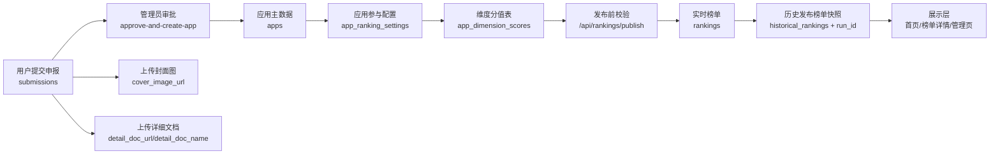
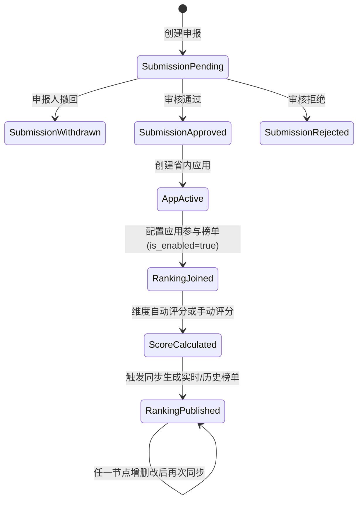

# 应用申报到榜单发布：数据流与状态流（夯实版）

## 1. 范围与目标
本说明覆盖以下主链路，并明确每个节点的增删改触发后的上下游同步响应：

1. 应用申报
2. 应用参与榜单
3. 维度分值计算
4. 榜单发布（实时榜单 + 历史榜单）

## 2. 字段收敛（本轮）
为避免语义混用，字段统一如下：

1. `access_url`：仅表示应用入口（集团应用直达入口等）。
2. `detail_doc_url` / `detail_doc_name`：仅表示应用详细文档。
3. 省内应用详情中的“详细文档”按钮，仅由 `detail_doc_url` 控制展示。
4. 榜单标识以 `ranking_config_id` 为主键语义；`ranking_type` 仅保留兼容查询。
5. 维度评分落表 `app_dimension_scores`，手动评分优先于自动评分。
6. `submissions.ranking_dimensions` 仅保留历史读兼容，新增写入已停用；榜单维度来源只看 `ranking_configs.dimensions_config`。

## 3. 数据流图

## 4. 状态流图

## 5. 链路增删改与上下游同步矩阵
| 节点 | 操作 | 下游影响 | 同步动作 |
|---|---|---|---|
| `submissions` | 新增/编辑（待审） | 仅影响审核池 | 不触发榜单同步 |
| `submissions` | 申报人修改（待审） | 更新审核池内容 | 不触发榜单同步 |
| `submissions` | 申报人撤回（待审） | 进入 `withdrawn`，退出审核池 | 不触发榜单同步 |
| `submissions` | 审核通过 | 生成 `apps` 记录 | 同事务触发同步，返回 `run_id` |
| `apps` 排行参数 | 修改权重/开关/标签 | 影响实时分值与排序 | 自动触发榜单同步 |
| `app_ranking_settings` | 新增/修改/删除参与榜单 | 影响参与范围与排序 | 自动触发榜单同步 |
| `app_ranking_settings + app_dimension_scores` | 原子保存（单请求） | 避免“部分成功” | 失败整单回滚，成功后触发统一同步 |
| `ranking_dimensions` | 新增/修改 | 影响分值规则 | 自动触发榜单同步 |
| `ranking_dimensions` | 删除 | 清理 `app_dimension_scores`，并从所有 `ranking_configs.dimensions_config` 剔除 | 同事务触发榜单同步 |
| `ranking_configs` | 新增/修改 | 影响榜单结构 | 自动触发榜单同步 |
| `ranking_configs` | 删除 | 清理 `app_ranking_settings`/`rankings`/`historical_rankings` 关联数据 | 同事务触发榜单同步 |
| `app_dimension_scores` | 手动改分 | 影响最终排序 | 自动触发榜单同步 |

## 6. 分值计算收敛规则
每个应用在某榜单中的最终分数：

`最终分 = Σ(维度分 × 维度权重) × 应用权重系数`

维度分来源：

1. 若当期存在手动评分（`calculation_detail` 以“手动调整评分”开头），优先使用手动评分。
2. 否则按规则自动计算并写入维度分值表。

## 7. 当前实现中的防漂移约束
1. 榜单同步时，会清理不再参与该榜单的实时记录，同时清理非活跃榜单配置的实时残留数据。
2. 评分同分时固定按 `score DESC + app_id ASC` 排序，避免重复同步出现名次抖动。
3. 每次链路关键节点变更后，会触发统一同步，并写入审计日志（含 `run_id`）。
4. 关键链路接口采用“先改对象、后统一同步、一次提交”策略，避免“数据已改但同步失败”造成的半成功状态。
5. 启动时自动补齐增量字段（`detail_doc_*`），降低旧库升级风险。

## 8. 后续可选强化
1. 将“手动评分”从 `calculation_detail` 标记升级为独立布尔字段（如 `is_manual`）。
2. 对同步任务引入异步队列，避免高频管理操作阻塞请求。
