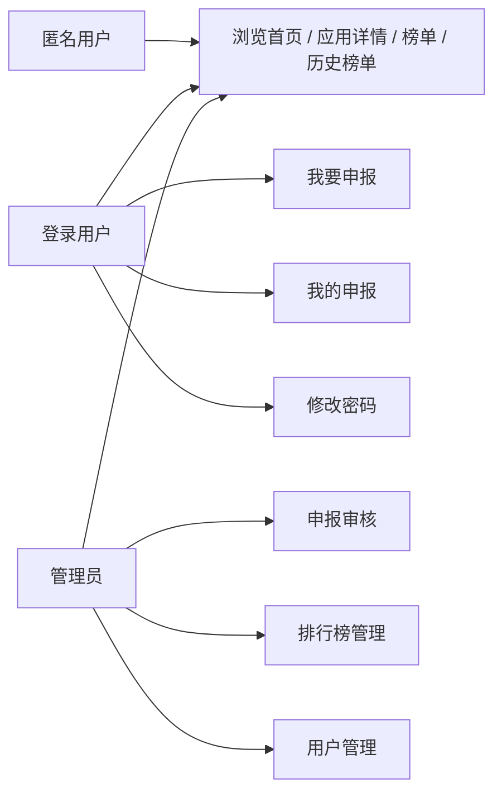
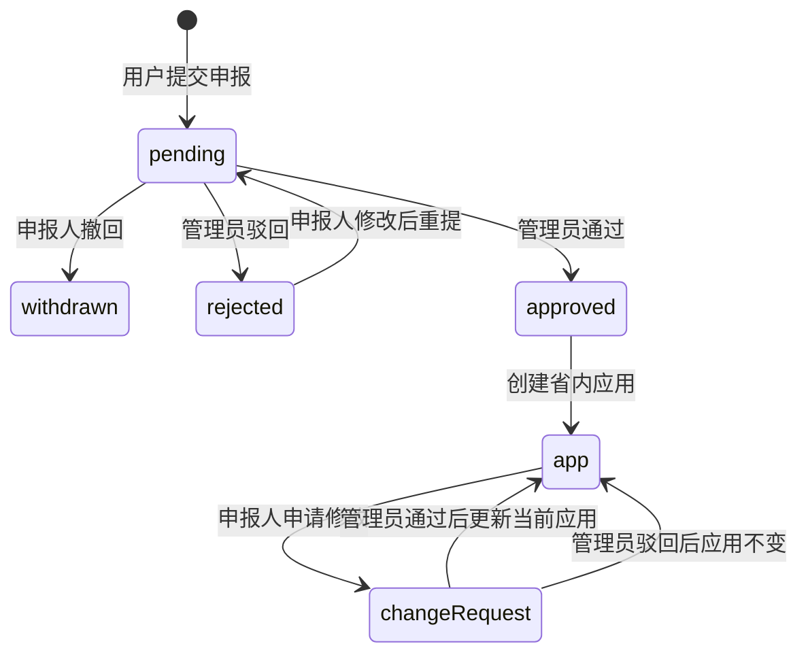
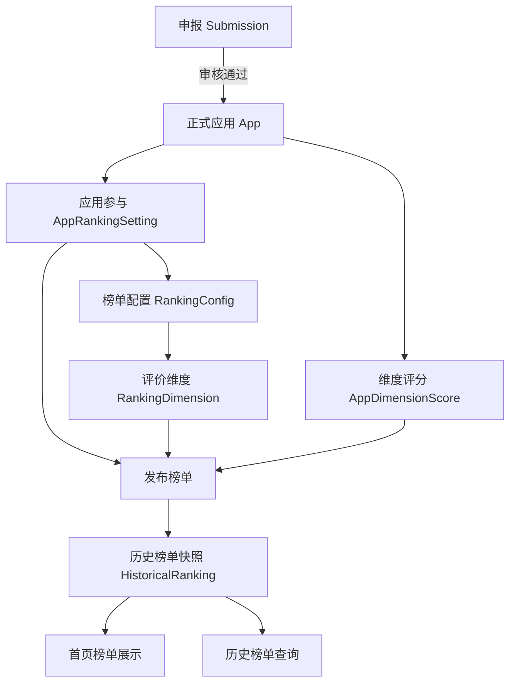
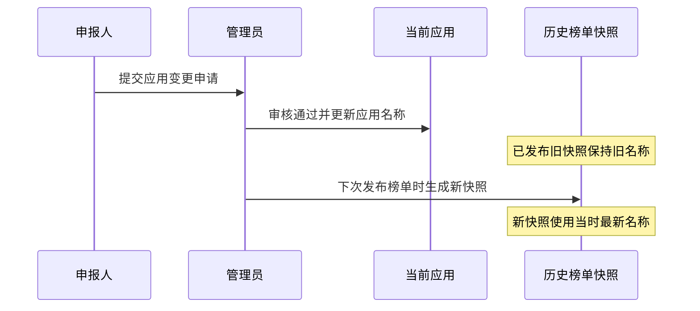

# AI 应用广场用户操作手册

## 1. 手册定位

本手册面向河北 AI 应用广场的日常使用人，按“我是谁、我要做什么、应该点哪里、完成后会发生什么”组织。

适用角色：

- 匿名用户：浏览首页、应用详情、排行榜和历史榜单。
- 申报用户：提交应用申报、查看我的申报、修改待审申报、拒绝后重提、对已通过应用申请修改。
- 管理员：审核申报、审核应用变更、维护榜单、发布榜单、管理用户。

特别说明：

- 系统中的集团应用和省内应用都定位为展示内容，不作为平台内跳转使用入口。
- 当前榜单只针对省内应用，集团应用不参与当前榜单。
- 首页榜单读取最新一次正式发布的历史快照，不读取未发布的实时草稿。
- 历史榜单保留发布当时名称；应用后续改名不会回写旧快照。

---

## 2. 先读懂系统关系

### 2.1 三类用户能做什么

理解要点：

- 不登录也能看内容。
- 只要涉及申报、我的记录、修改密码，就需要登录。
- 管理能力只对管理员开放。

### 2.2 申报如何变成应用

理解要点：

- `pending` 待审核：申报人还能修改或撤回。
- `rejected` 已拒绝：申报人可按反馈修改后重提。
- `approved` 已通过：已经转成正式应用，不能直接改，只能提交应用变更申请。
- 应用变更申请通过后，只更新当前应用信息，不改历史榜单旧快照。

### 2.3 应用、榜单、权重和历史快照是什么关系

理解要点：

- 正式应用是当前展示内容。
- 应用是否参与榜单、参与哪个榜单、权重和标签，由“排行榜管理”的应用参与配置控制。
- 评价维度和维度评分影响榜单计算。
- 发布后形成历史榜单快照，首页和历史榜单都读取已发布快照。
- 旧快照是留痕，不会因为应用后来改名而改写。

### 2.4 应用改名后榜单怎么显示

理解要点：

- 过去发布时叫什么，历史榜单就保留什么。
- 当前应用叫什么，应用详情和下次发布的新榜单就使用什么。

---

## 3. 匿名用户：浏览和查看

### 3.1 浏览首页

1. 打开系统首页。
2. 默认可看到总应用榜和增长趋势榜。
3. 通过“应用视图”查看集团应用和省内应用。
4. 使用来源、状态、分类、公司、关键词筛选应用。

【截图占位-S01】首页全景

- 建议截图页面：首页
- 建议高亮：平台标题、我要申报、管理员登录、总应用榜、增长趋势榜、应用视图入口

【截图占位-S02】首页筛选区

- 建议截图页面：首页应用视图
- 建议高亮：应用来源、状态、分类、公司、关键词输入框

### 3.2 查看应用详情

1. 在首页点击应用卡片。
2. 查看应用简介、业务场景、成效指标、联系人、附件等信息。
3. 如有详细文档，可在详情中查看文档入口。

注意：

- 应用详情用于展示，不提供平台内直接跳转使用入口。
- 如果一个应用已被改名，应用详情展示当前最新名称。

【截图占位-S03】应用卡片入口

- 建议截图页面：首页应用列表
- 建议高亮：应用名称、来源、分类、卡片点击区域

【截图占位-S04】应用详情

- 建议截图页面：应用详情弹窗
- 建议高亮：基础信息、业务场景、成效指标、详细文档

### 3.3 查看排行榜和历史榜单

1. 首页默认展示最新一次正式发布榜单。
2. 可切换查看总应用榜和增长趋势榜。
3. 点击历史榜单入口，可按日期查看已发布快照。

注意：

- 首页榜单不是实时草稿，而是最新一次正式发布快照。
- 历史榜单保留发布当时信息，旧名称不会被后续改名覆盖。

【截图占位-S05】首页双榜单

- 建议截图页面：首页榜单区
- 建议高亮：总应用榜、增长趋势榜、排名、应用名称

【截图占位-S06】历史榜单

- 建议截图页面：历史榜单页
- 建议高亮：榜单类型、日期筛选、榜单列表

---

## 4. 申报用户：提交和跟进

### 4.1 登录

1. 在首页点击“我要申报”或“登录”入口。
2. 输入账号密码。
3. 如账号使用初始密码或管理员重置密码，系统会要求先修改密码。
4. 登录完成后返回业务页面。

强口令要求：

- 至少 10 位。
- 大写字母、小写字母、数字、符号四类中至少包含三类。

【截图占位-S07】登录入口

- 建议截图页面：首页右上角或我要申报入口
- 建议高亮：我要申报、登录提示

【截图占位-S08】登录页

- 建议截图页面：登录页
- 建议高亮：账号、密码、登录按钮

### 4.2 修改密码

适用场景：

- 首次登录后系统要求修改初始密码。
- 管理员重置密码后首次登录。
- 用户主动想修改自己的密码。

操作步骤：

1. 登录后，在首页右上角用户头像或姓名旁点击“修改密码”。
2. 输入当前密码、新密码、确认新密码。
3. 新密码满足强口令要求。
4. 提交成功后返回首页。

注意：

- 匿名游客看不到“修改密码”入口。
- 修改成功后，当前会话继续有效，其他旧会话会失效。

【截图占位-S09】修改密码入口

- 建议截图页面：首页右上角用户区
- 建议高亮：用户姓名、修改密码按钮

【截图占位-S10】修改密码页

- 建议截图页面：修改密码页
- 建议高亮：当前密码、新密码、确认新密码、强口令提示

### 4.3 我要申报

适用场景：

- 你要把一个省内 AI 应用提交到平台审核。

操作步骤：

1. 在首页点击“我要申报”。
2. 如果未登录，先登录；登录成功后系统会自动回到首页并打开申报弹窗。
3. 填写应用名称、联系人、应用分类、应用场景、嵌入系统、问题描述、成效指标、预期收益等信息。
4. 上传封面图和详细文档。
5. 点击“提交申报”。
6. 提交成功后，进入“我的申报”跟进状态。

填写建议：

- 应用名称应使用业务上可识别的正式名称。
- 应用场景写清楚“谁在什么场景下使用”。
- 问题描述写清楚原来痛点。
- 成效指标尽量写可验证的指标，如时长下降、效率提升、成本节约、满意度提升。

【截图占位-S11】申报弹窗

- 建议截图页面：首页申报弹窗
- 建议高亮：应用名称、联系人、应用场景、问题描述、成效指标

【截图占位-S12】附件上传

- 建议截图页面：申报弹窗
- 建议高亮：封面图上传、详细文档上传

【截图占位-S13】提交成功

- 建议截图页面：提交成功反馈或我的申报入口
- 建议高亮：成功提示、我的申报按钮

### 4.4 我的申报

进入方式：

1. 登录后进入首页。
2. 点击“我的申报”。
3. 查看本人提交过的申报记录。

状态说明：

| 状态 | 含义 | 申报人能做什么 |
| --- | --- | --- |
| 待审核 pending | 已提交，管理员还未处理 | 修改、撤回 |
| 已通过 approved | 管理员已通过，并创建正式应用 | 申请修改 |
| 已拒绝 rejected | 管理员驳回并给出原因 | 修改后重提 |
| 已撤回 withdrawn | 申报人主动撤回 | 不再进入当前审核 |

【截图占位-S14】我的申报列表

- 建议截图页面：我的申报页
- 建议高亮：应用名称、状态、操作按钮

### 4.5 修改待审核申报

适用状态：待审核。

操作步骤：

1. 进入“我的申报”。
2. 找到状态为“待审核”的记录。
3. 点击“修改”。
4. 调整申报内容。
5. 点击保存。

注意：

- 只有待审核申报可以直接修改。
- 已通过应用不能直接改申报记录，需要走“申请修改”。

【截图占位-S15】修改待审核申报

- 建议截图页面：我的申报页/修改申报弹窗
- 建议高亮：修改按钮、保存按钮

### 4.6 撤回待审核申报

适用状态：待审核。

操作步骤：

1. 进入“我的申报”。
2. 找到状态为“待审核”的记录。
3. 点击“撤回”。
4. 在确认框中确认撤回。

注意：

- 撤回后，该记录不再进入当前审核。
- 如需再次提交，按新申报流程重新提交。

【截图占位-S16】撤回申报

- 建议截图页面：我的申报页
- 建议高亮：撤回按钮、二次确认框

### 4.7 已拒绝申报：修改后重提

适用状态：已拒绝。

操作步骤：

1. 进入“我的申报”。
2. 找到状态为“已拒绝”的记录。
3. 查看拒绝原因。
4. 点击“修改后重提”。
5. 按管理员反馈补充或修正内容。
6. 提交后，该记录重新变为“待审核”。

【截图占位-S17】拒绝后重提

- 建议截图页面：我的申报页
- 建议高亮：拒绝原因、修改后重提按钮、重新提交按钮

### 4.8 已通过应用：申请修改

适用状态：已通过。

操作步骤：

1. 进入“我的申报”。
2. 找到状态为“已通过”的记录。
3. 点击“申请修改”。
4. 填写需要更新的应用信息。
5. 提交变更申请。
6. 等待管理员审核。

注意：

- 已通过应用已经是正式应用，不能直接由申报人改。
- 同一应用同一时间只能有一条待审核变更申请。
- 管理员通过后，当前应用信息会更新。
- 历史排行榜旧快照不会跟着改名或改内容。

【截图占位-S18】申请修改应用

- 建议截图页面：我的申报页/申请修改弹窗
- 建议高亮：申请修改按钮、提交变更申请按钮、待审核变更提示

---

## 5. 管理员：审核和运营

### 5.1 管理员登录

操作步骤：

1. 在首页点击“管理员登录”。
2. 输入管理员账号密码。
3. 登录后进入管理入口。

注意：

- 普通用户访问管理页会被拦截。
- 管理员也可以进行普通浏览和申报相关操作，但管理操作必须使用管理员账号。

【截图占位-S19】管理员登录入口

- 建议截图页面：首页
- 建议高亮：管理员登录按钮

【截图占位-S20】无权限提示

- 建议截图页面：普通用户访问管理页
- 建议高亮：无权限提示、返回入口

### 5.2 审核新申报

操作步骤：

1. 进入“申报审核”。
2. 查看普通申报列表。
3. 打开待审核记录详情。
4. 核对基础信息、应用场景、问题描述、成效指标、附件。
5. 如信息合格，点击“通过审核”。
6. 如信息不合格，点击“拒绝”，填写拒绝原因。

通过后会发生什么：

- 申报记录变为“已通过”。
- 系统创建正式省内应用。
- 应用进入“排行榜管理”的应用参与维护范围。

拒绝后会发生什么：

- 申报记录变为“已拒绝”。
- 申报人可看到拒绝原因，并可修改后重提。

【截图占位-S21】申报审核列表

- 建议截图页面：申报审核页
- 建议高亮：待审核记录、通过审核、拒绝按钮

【截图占位-S22】申报详情和审批设置

- 建议截图页面：申报审核详情弹窗
- 建议高亮：基础信息、审批设置、通过审核按钮

### 5.3 审核应用变更

操作步骤：

1. 进入“申报审核”。
2. 切换到“应用变更”。
3. 查看待审核变更申请。
4. 打开变更详情。
5. 判断是否允许更新当前应用信息。
6. 点击“通过变更”或“驳回”。

通过后会发生什么：

- 当前正式应用信息更新。
- 来源申报记录同步更新为最新口径。
- 榜单参与关系、权重、维度评分继续挂在同一个应用 ID 上。
- 历史榜单旧快照不回写。

驳回后会发生什么：

- 当前正式应用不变。
- 申报人可看到变更申请被驳回。

【截图占位-S23】应用变更列表

- 建议截图页面：申报审核页/应用变更入口
- 建议高亮：待审变更数量、通过变更、驳回按钮

【截图占位-S24】应用变更详情

- 建议截图页面：应用变更详情弹窗
- 建议高亮：变更内容、榜单影响提示、通过变更按钮

### 5.4 排行榜管理总览

排行榜管理用于维护榜单规则、应用参与、应用状态、集团应用录入、评价维度和变更日志。

常见入口：

- 榜单配置：维护总应用榜和增长趋势榜配置。
- 应用参与：维护哪些应用参与哪些榜单，以及权重、标签。
- 应用管理：管理应用当前状态，例如下架或重新上架。
- 集团应用录入：管理员录入集团应用展示内容。
- 评价维度：维护评价维度。
- 变更日志：查看榜单链路关键操作记录。

【截图占位-S25】排行榜管理总览

- 建议截图页面：排行榜管理页
- 建议高亮：各 Tab、发布榜单按钮

### 5.5 维护应用参与和权重

操作步骤：

1. 进入“排行榜管理”。
2. 打开“应用参与”。
3. 找到目标应用。
4. 点击“添加参与”或“编辑”。
5. 选择参与的榜单。
6. 设置是否启用、权重系数、自定义标签、维度评分。
7. 保存。

理解要点：

- 应用是否参与榜单，以“应用参与”配置为准。
- 权重影响该应用在对应榜单中的计算结果。
- 同一个应用可以分别参与总应用榜和增长趋势榜。

【截图占位-S26】应用参与维护

- 建议截图页面：排行榜管理/应用参与
- 建议高亮：参与的榜单、添加参与、编辑按钮

【截图占位-S27】应用参与编辑弹窗

- 建议截图页面：添加参与或编辑弹窗
- 建议高亮：榜单、启用状态、权重、标签、维度评分

### 5.6 发布榜单

操作步骤：

1. 确认应用参与、权重、维度评分已经维护。
2. 点击“发布榜单”。
3. 等待发布完成。
4. 回到首页或历史榜单查看正式快照。

注意：

- 发布后会生成历史榜单快照。
- 首页展示最新一次正式发布结果。
- 历史榜单用于追溯，不能因为应用后续变更而随意改写。

【截图占位-S28】发布榜单

- 建议截图页面：排行榜管理页
- 建议高亮：发布榜单按钮、发布成功提示

### 5.7 应用管理和集团应用录入

应用管理：

1. 进入“排行榜管理”。
2. 打开“应用管理”。
3. 查看应用名称、分区、公司/部门、分类、状态。
4. 对应用执行下架或重新上架。

集团应用录入：

1. 打开“集团应用录入”。
2. 填写集团应用展示信息。
3. 保存后，集团应用可在应用视图中展示。

注意：

- 集团应用只作为展示内容，不参与当前榜单。
- 省内应用下架后不在首页展示，并会失去当前榜单参与资格；历史榜单保留。

【截图占位-S29】应用管理

- 建议截图页面：排行榜管理/应用管理
- 建议高亮：应用名称、公司/部门、状态、操作按钮

【截图占位-S30】集团应用录入

- 建议截图页面：排行榜管理/集团应用录入
- 建议高亮：应用名称、组织、分类、场景、保存按钮

### 5.8 用户管理

操作步骤：

1. 进入“用户管理”。
2. 查看用户列表。
3. 新建用户或编辑已有用户。
4. 设置用户角色、启用状态、是否可申报。
5. 如需新建或重置密码，填写强口令。
6. 保存。

注意：

- 新建或重置后的密码视为临时密码。
- 用户下次登录后必须先改成自己的强口令。
- 不要把真实密码写入文档、截图或聊天记录。

【截图占位-S31】用户管理列表

- 建议截图页面：用户管理页
- 建议高亮：用户、角色、状态、申报权限、操作按钮

【截图占位-S32】新建或编辑用户

- 建议截图页面：用户编辑弹窗
- 建议高亮：角色、启用状态、申报权限、密码输入框

---

## 6. 常见问题

### 6.1 登录失败怎么办？

- 确认账号密码是否正确。
- 如果连续失败，稍后再试或联系管理员。
- 如果是初始密码或重置密码，登录后需要先修改为个人强口令。

### 6.2 为什么看不到“我要申报”或“我的申报”？

- 未登录时只能浏览。
- 登录后首页会显示“我要申报”和“我的申报”入口。

### 6.3 为什么访问管理页被拒绝？

- 当前账号不是管理员。
- 请联系管理员确认账号角色。

### 6.4 申报提交失败怎么办？

- 检查必填项是否完整。
- 检查应用名称是否与同单位已有待审或已通过申报重复。
- 检查应用分类、数据级别、成效类型等是否选择正确。
- 检查附件是否符合系统限制。

### 6.5 已通过应用为什么不能直接修改？

已通过申报已经创建正式应用。为了保证展示内容和榜单链路可信，申报人只能提交“申请修改”，由管理员审核通过后更新当前应用。

### 6.6 应用改名后，历史榜单为什么还是旧名称？

历史榜单是发布当时的正式快照。过去发布时是什么名称，历史榜单就保留什么名称。应用改名后，当前应用详情和下次发布的新榜单会使用新名称。

### 6.7 应用变更后，榜单权重会不会丢？

不会。榜单参与、权重和维度评分都按同一个应用 ID 关联。应用改名或修改展示信息，不会重建应用，也不会自动清空榜单配置。

### 6.8 页面打不开或样式异常怎么办？

- 刷新浏览器。
- 重新登录。
- 如系统部署在 `/AISquare/` 子路径，确认访问地址包含正确前缀。
- 仍有问题时，记录访问地址、时间、账号和操作步骤反馈管理员。

---

## 7. 页面入口速查

| 页面 | 谁能访问 | 主要用途 |
| --- | --- | --- |
| 首页 | 所有人 | 浏览应用、查看榜单、进入申报和管理入口 |
| 应用详情 | 所有人 | 查看应用展示信息 |
| 历史榜单 | 所有人 | 查看已发布榜单快照 |
| 登录页 | 未登录用户 | 登录系统 |
| 修改密码 | 登录用户 | 主动修改个人密码 |
| 我要申报 | 登录用户 | 提交省内应用申报 |
| 我的申报 | 登录用户 | 查看申报状态、修改待审、拒绝后重提、申请修改 |
| 申报审核 | 管理员 | 审核新申报和应用变更 |
| 排行榜管理 | 管理员 | 配置榜单、应用参与、发布榜单、应用管理 |
| 用户管理 | 管理员 | 维护账号、角色、状态和密码 |

---

## 8. 手册维护说明

- 本手册只写业务使用方法，不写部署命令和数据库迁移步骤。
- 部署与数据库变更以 `docs/db-migration-sop.md` 和发布部署说明为准。
- 产品、榜单、身份和数据真相源口径以 `docs/GOVERNANCE.md` 为准。
- 新增页面、重命名入口或调整状态流转后，应同步更新本手册。
